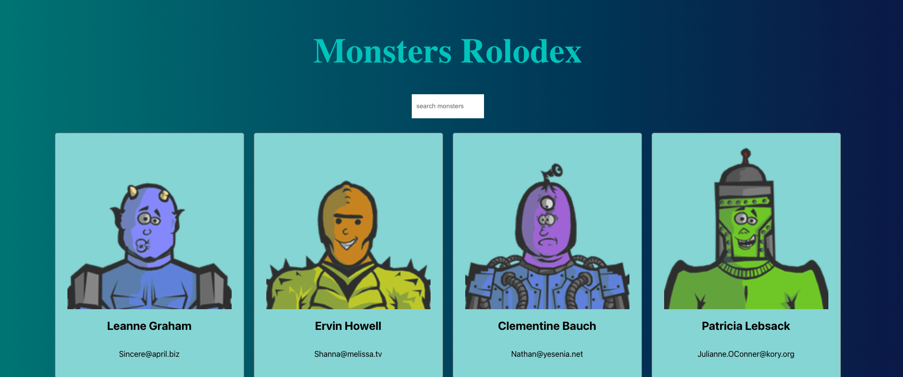
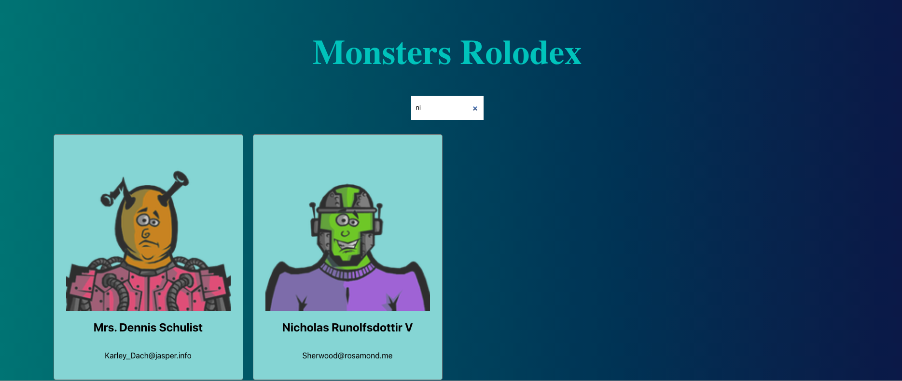

# Monsters Rolodex
Monsters Rolodex is a fun web aplication for see the name and email of the monsters and you can filter by name.

You can access the project hosted in the web by [clicking here]()

 ## Technologies
- REACTJS
- HTML
- CSS
- JAVASCRIPT

# Getting Started

Open the `TERMINAL` and type `npm install` and then `npm start`.